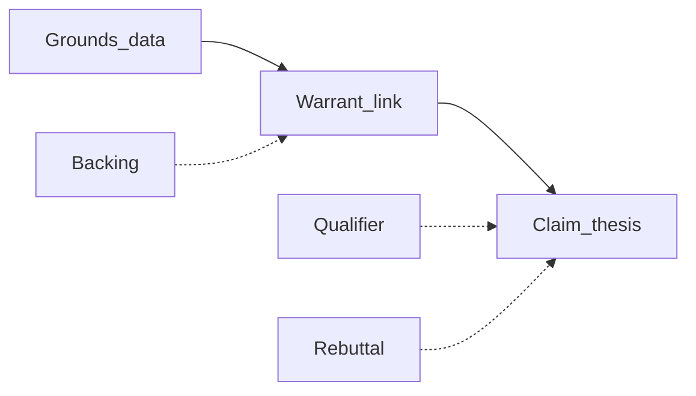

# Конспект: виды и способы аргументов

Сводка по нескольким источникам: академическая риторика (классификация доводов), модель Тулмина (структура одного аргумента), учебная шпаргалка по логике. Дополняет [01_День_1_Риторика_и_структура.md](01_День_1_Риторика_и_структура.md) и не дублирует [09_Конспекты_статей_эссе.md](09_Конспекты_статей_эссе.md) (там — про жанр и структуру эссе).

**Источники**

- [Purdue OWL — Toulmin Argument](https://owl.purdue.edu/owl/general_writing/academic_writing/historical_perspectives_on_argumentation/toulmin_argument.html) — модель Тулмина (claim, grounds, warrant и др.).
- [RELGA — «Общие принципы классификации доводов»](http://relga.ru/articles/1328/) (Т. Хазагеров, Л. Ширина) — естественные / искусственные доказательства, логические / этические / чувственные.
- [Кампус — «Типы аргументов»](https://kampus.ai/referat/tipy-argumentov-37965/) — вспомогательная сжатая схема (дедукция, индукция, аналогия, авторитет и т.д.).

---

## 1. Два уровня: из чего состоит аргумент и как его классифицируют

### 1.1. Структура одного аргумента (Тулмин)

| Элемент | Смысл |
|--------|--------|
| **Claim** | Тезис — что ты хочешь доказать. |
| **Grounds** | Данные: факты, статистика, цитата из текста задания, наблюдение. |
| **Warrant** | Связка: *почему* из данных следует тезис. Часто не сказана вслух; без неё аргумент «рвётся». |
| **Backing** | Подкрепление самой связки, если её оспаривают. |
| **Qualifier** | Оговорки («часто», «в ряде случаев») — меньше категоричности, больше доверия. |
| **Rebuttal** | Учёт сильного контраргумента или границ, где тезис не работает. |

Квалификаторы и rebuttal по [OWL](https://owl.purdue.edu/owl/general_writing/academic_writing/historical_perspectives_on_argumentation/toulmin_argument.html) помогают **этосу**: ты выглядишь внимательным к возражениям, а не «ломишь одну линию».

### 1.2. Классификация доводов (риторика, RELGA)

- **Естественные доказательства** — то, что «само убеждает»: свидетельства, документы, экспертиза, научный анализ (близко к сильным **фактам** из дня 1).
- **Искусственные** — построены речью:
  - **Логические** — дедукция, индукция, аналогия, пример, дилемма и т.п.
  - **Этические** — к нормам, характеру, репутации (пересекается с **этосом** и частью мотивации из **пафоса**).
  - **Чувственные (патетические)** — к страхам, надеждам, настроению (**пафос**; без фактов — риск манипуляции).

Позднее логические и естественные часто объединяют как доводы **ad rem** (по существу), в отличие от ухода **ad hominem** (к человеку вместо тезиса).

---

## 2. Виды аргументов по логической форме (способы вывода)

- **Дедукция** — вывод из общих посылок; при верных посылках и корректной форме вывод обязателен. В речи часто **энтимема** — сокращённый силлогизм (часть посылок молчит).
- **Индукция** — от частных случаев к общему; сила зависит от **полноты** и **репрезентативности** примеров (один кейс не доказывает закон).
- **Аналогия** — сходство ситуаций; сильна как **иллюстрация**, слабее как доказательство «в А так — значит и в Б» без проверки важных различий.
- **Причинно-следственные рассуждения** — «из-за X произошло Y»; проверяй альтернативные причины и не путай **следование во времени** с **причинностью**.
- **Аргумент от знака / симптома** — по косвенным признакам судят о целом; легко скатиться в поспешное обобщение.

---

## 3. Способы аргументации (к чему апеллируют)

- **Ad rem** — к фактам, логике, тексту задания; база для аналитического эссе.
- **К авторитету** — уместно, если эксперт в **той же** области; слабо, если «звезда не из темы».
- **От традиции / общепринятого** — «так принято»; описывает статус-кво, не доказывает справедливость.
- **От последствий** — «если сделаем так, будет плохо/хорошо»; проверяй правдоподобность сценария.
- **Ad hominem** (вместо разбора тезиса) — в академической аргументации обычно ошибка; для экзамена лучше не опираться.

---

## 4. Связка с днём 1: логос, пафос, этос и «сила»

- **Логос** — дедукция, индукция, данные, причинность, определения; в терминах Тулмина — **grounds** и явный **warrant**.
- **Пафос** — ценности, идентичность, эмоциональный резонанс (риторика: чувственные и часть этических доводов) — без отрыва от тезиса.
- **Этос** — честность, оговорки, контраргументы (**qualifier**, **rebuttal**), аккуратность с обобщениями.

**Грубая шкала силы** (как в дне 1, уточнение): выше — проверяемое и узкое по теме; ниже — одна аналогия или один личный случай как «доказательство всего подряд».

---

## 5. Мини-практика для эссе (три вопроса к абзацу)

1. Какой **тип** довода: факт, логика, аналогия, авторитет, опыт?
2. Где **warrant** — одно предложение «почему это бьёт в тезис»?
3. Нужна ли **оговорка** (qualifier), чтобы не утверждать больше, чем следует из данных?

---

## Схема Тулмина (наглядно)

---

**Следующий шаг по плану недели:** продолжать с [02_День_2_Философский_текст.md](02_День_2_Философский_текст.md) или возвращаться к практике из [01_День_1_Риторика_и_структура.md](01_День_1_Риторика_и_структура.md).
